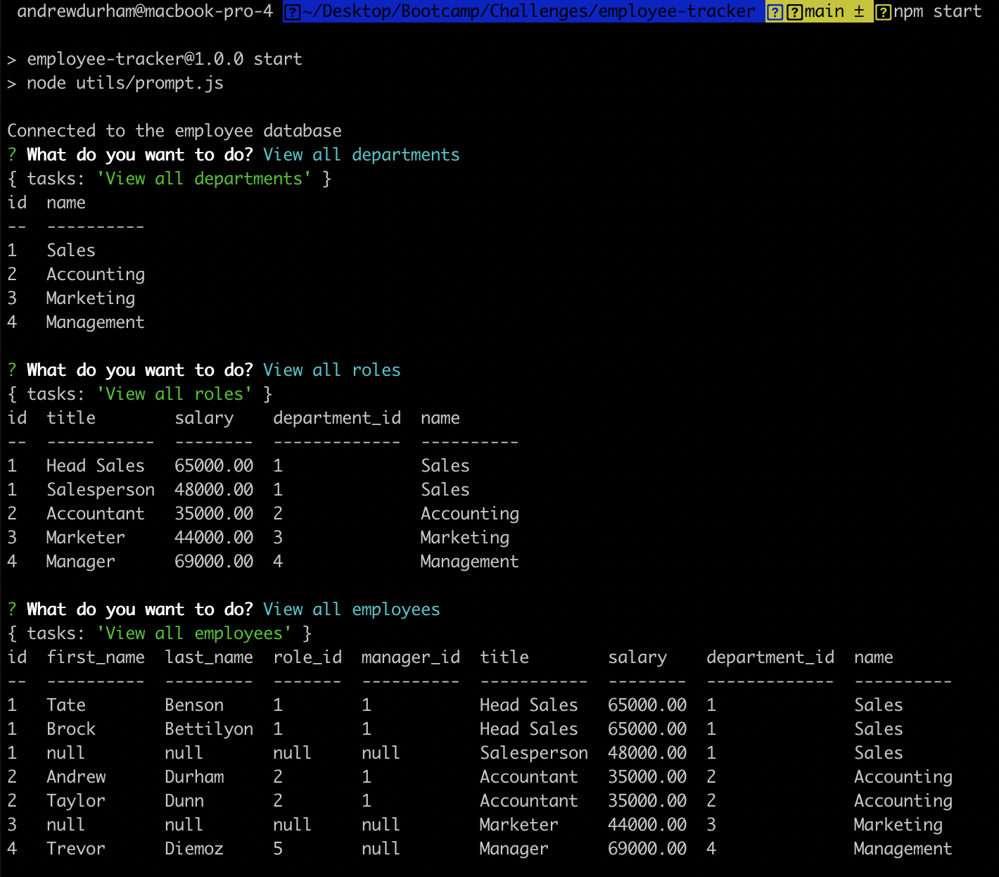

# employee-tracker

## Description

A project built with inquirer that allows a user to edit an employee database through a series of prompts
## Demonstration
### Video

### Screenshot

## Table of Contents

* [Installation](#installation)
* [Usage](#usage)
* [License](#license)
* [Contributing](#contributing)
* [Questions](#questions)

## Installation

To run this application, please do the following installation:

`
npm i
`

## Usage
`
npm start
`

To populate database in mysql:

`
source db/db.sql
`

`
source db/schema.sql
`

`
source db/seeds.sql
`
## License

This application is covered under the MIT license.
## Questions

Link to my GitHub: [andydhpkp](https://github.com/andydhpkp).

Email me for any questions at: [andrewdurham1094@gmail.com](mailto:andrewdurham1094@gmail.com).

